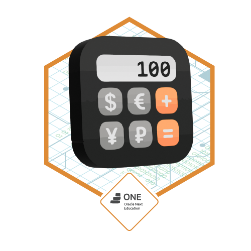

## 💻Challenge - Conversor de moedas - ONE(G8)
Aplicação em java que realiza conversão entre moedas usando a API ExchangeRate.
Ideal para praticar a integração com APIs externas, requisição HTTP e manipulação 
de arquivos JSON com a biblioteca GSON.

<div align="center">
    
</div>

---
## 🛠Tecnologias Utilizadas
- ☕Java 17+
- 🌐Http Client ('java.net.http')
- 🔧Gson (Google)
- 🔎EnchangeRate API
---
## 📸 Demonstração Terminal
````
*************************************************
Bem-vindo(a) ao Conversor de Moedas!
1) Dólar (USD) =>> Real Brasileiro (BRL)
2) Real Brasileiro (BRL) =>> Dólar (USD)
3) Euro (EUR) =>> Real Brasileiro (BRL)
4) Real Brasileiro (BRL) =>> Euro (EUR)
5) Franco Suiço (CHF) =>> Dólar (USD)
6) Dólar (USD) =>> Franco Suiço (JPY)
7) Sair
*************************************************
Escolha uma opção válida:
````
---

## Como executar o projeto
1. **Clone o repositório**
```` bash
git clone https://github.com/gersonccruz/challenge-conversor-de-moedas-ONE.git
cd conversor-moedas
````
2. Compile e execute com sua IDE(intelliJ, VS CODE, etc.)
---
## Copilando código no terminal
````
javac -d out -cp "lib/*" src/com/gersonccruz/conversor/**/*.java
java -cp "out;lib/*" com.gersonccruz.conversor.principal.Main
````
